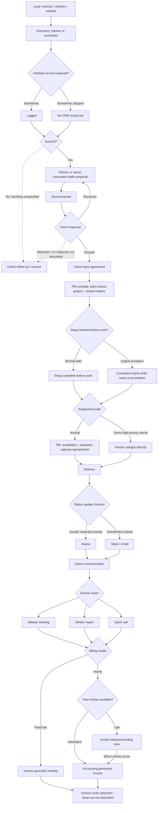
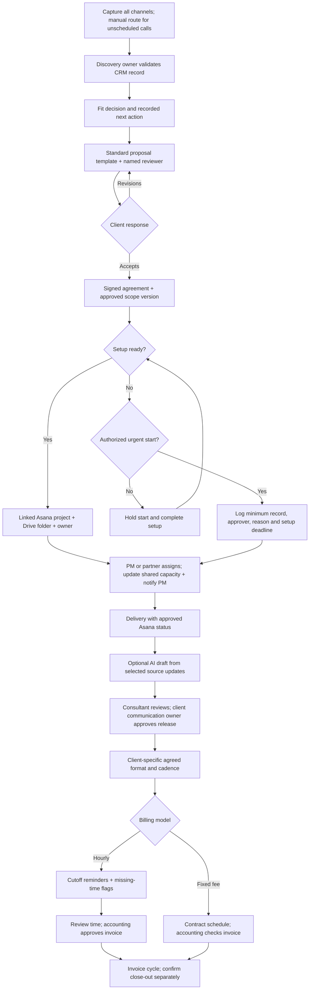

# Workflow diagrams

The current state follows the supplied transcript. Dotted exits identify unspecified handling. The proposed future state includes new controls requiring validation.

## Current state

## Proposed future state

